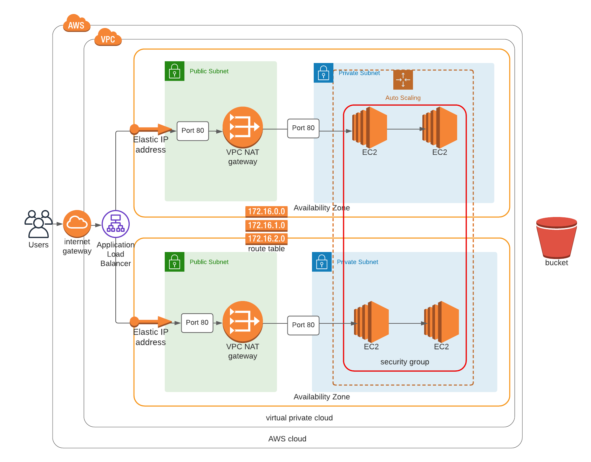

# Deploying a highly available web application using CloudFormation

## IaC

For this project, the goal is to use Infrastructure as Code, or IaC, to deploy a highly available web application through AWS CloudFormation. The IaC process uses definition files to manage and provision data centers, rather than interactive configuration tools and can therefore deploy data centers reliably in an automatic fashion.

## Network and Server resources

The network stack consists of a VPC, with a pair of public and private subnets spread across two Availability Zones. It deploys an Internet Gateway with a default route on the public subnets. It deploys a pair of NAT Gateways (one in each AZ) and default routes for them in the private subnets.

The server stack creates an autoscaling group, a load balancer, the required security groups, an IAM role with an S3ReadOnlyAccess policy, and EC2 instances.

## Web application installation

The chosen EC2 instances come with Ubuntu pre-installed and the server stack uses the commands below to install awscli and apache2. After the installation of these dependencies, a zip file containing the HTML is copied from a Udacity managed s3 bucket and into the EC2 instances to deploy the web application.

```bash
#!/bin/bash
apt-get update -y
apt-get install unzip awscli -y
apt-get install apache2 -y
systemctl start apache2.service
cd /var/www/html
aws s3 cp s3://udacity-demo-1/udacity.zip .
unzip -o udacity.zip
```

## Diagram

As seen in the diagram below the server stack consists of an autoscaling group in private subnets providing a minimum of two EC2 instances in two different Availability Zones to ensure high availability for the web application.



## Web application test example

A link to the dummy web application provided by Udacity can be found in the outputs of the server stack. One example of such a link is provided here.

[http://serve-webap-1s7p4pezt4zbh-258404552.us-west-2.elb.amazonaws.com](http://serve-webap-1s7p4pezt4zbh-258404552.us-west-2.elb.amazonaws.com)

## Launch stack

To launch the stack you need to run the ```create.sh``` file containing CloudFormation commands, and provide the correct number of suitable arguments matching the positional arguments.

### Give execute permission to files (only needed the first time)

```bash
chmod +x create.sh  
chmod +x update.sh
chmod +x delete.sh
```

### Create and Update Network

```bash
./create.sh NetworkIaC network.yml network-parameters.json
```

```bash
./update.sh NetworkIaC network.yml network-parameters.json
```

### Create and Update Servers

```bash
./create.sh ServerStack servers.yml server-parameters.json
```

```bash
./update.sh ServerStack servers.yml server-parameters.json
```

### Delete Servers and Networks

```bash
./delete.sh ServerStack
./delete.sh NetworkIaC
```
